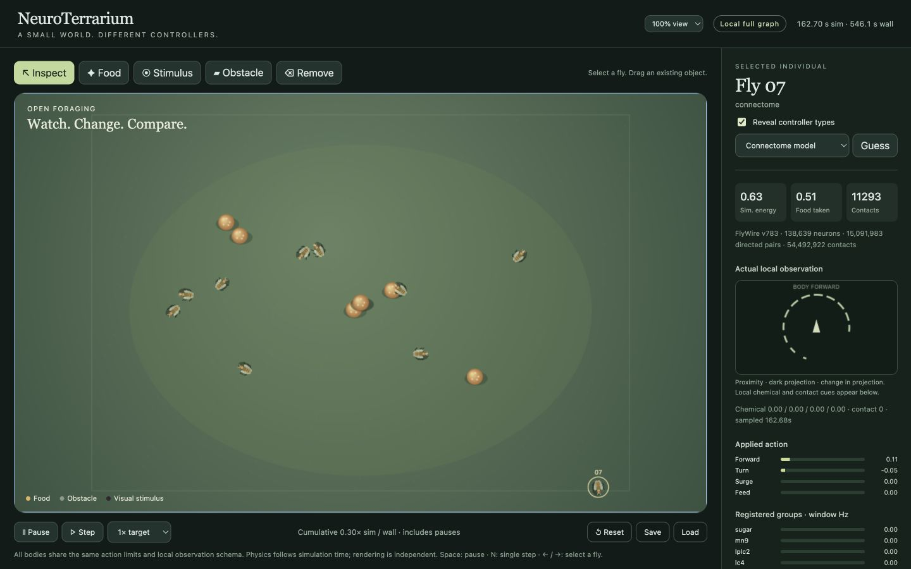

# NeuroTerrarium

A small, interactive fly-behavior sandbox: one complete FlyWire v783 connectome-constrained LIF model and nine independently trained neural policies share the same bodies, local observations and simulation clock.

Place food, move a visual stimulus, draw an obstacle, inspect an individual's actual input, or fork the current state and intervene on one branch. This is a simplified computational comparison, not a complete animal reconstruction.



**[Recorded playground](https://yeopbong.github.io/neuroterrarium/)** · **[Downloads](https://github.com/yeopbong/neuroterrarium/releases)** · [Methods](docs/methods.md) · [Data and licenses](docs/data.md) · [Models](docs/models.md)

## Run locally

Download the macOS arm64 installation archive from Releases and unpack it into a writable folder. It includes Python, dependencies and all nine trained models. Prepare the public neural data once:

```sh
./neuroterrarium data fetch
```

Then launch:

```sh
./neuroterrarium app --open-browser
```

The local application runs the complete graph and all ten controllers. After preparation it needs no network service. The archive is unsigned and unnotarized; no system certification is claimed. See [installation and checks](docs/install.md) for the tested platform, or follow the [source setup](docs/install.md#from-source).

The public website is **Replay**: it displays an actual recorded run and its recorded inspector values. Environment and circuit interventions require the local application. Replay does not perform full-brain inference in the browser.

## Try it

- Select a fly to see the observation used for its latest action. Reveal controller types, or use the optional guessing game.
- Use Food, Stimulus, Obstacle and Remove tools. Drag existing food or stimuli with Inspect. Visual-only shadows are distinct from physical threats.
- Adjust display scale, pause, single-step, save or load complete state, and view the recent recorded history. Space pauses; N advances one action window.
- Fork an identical snapshot. Choose the right branch for sensory or registered-circuit interventions, compare the resulting paths, then restore the intervention settings.

The brain retains all **138,639 neurons**, **15,091,983 directed connections** and **54,492,922 synaptic contacts** from the verified paired v783 data. Its sensory injection and motor readout are explicit engineering interfaces. A GF-driven surge has no inferred escape direction. The three feedforward, three recurrent and three recurrent-plus-reflex policies each received **1,000,000 environment transitions** from an independent training run. Their weights remain fixed during play; weak runs are retained.

```sh
./neuroterrarium doctor
./neuroterrarium data verify
./neuroterrarium validate --output validation-run
./neuroterrarium replay "$HOME/Downloads/neuroterrarium-recording.json" --open-browser
```

Use **Download recorded frames** in the local application to save a replay file.
Pass its actual absolute path to `replay`; the portable launcher runs from its
own installation directory. A saved full-state snapshot is a different format.

[Results](docs/results.md) cover stimulus responses, food, collisions and simulated energy.

Code is MIT. FlyWire-derived data retain **CC BY-NC 4.0** conditions and required scientific attribution. The [data manifest](configs/data-v783.json) fixes revisions and checksums; [third-party notices](THIRD_PARTY_NOTICES.md) preserve upstream code and dataset credits.
